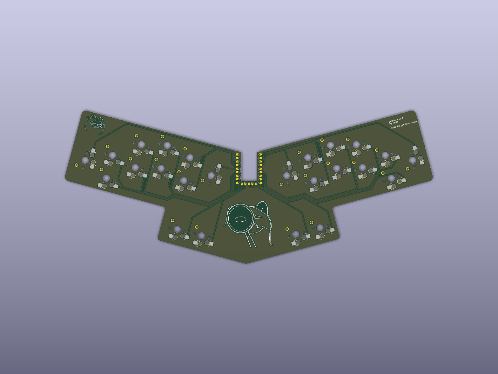

# pinboard

A 24-key unibody keyboard built for chorded typing with the [Pinchord](https://grahp.dev/pinchord) layout.

Pinchord is a chording system where you press a few keys at the same time to spell whole words instead of tapping them out letter by letter. The keys are split into three groups: the left fingers handle the start of a word, the thumbs and right index do the vowels, and the right fingers finish it off. So "pat" is left-P + middle-A + right-T pressed together, all in one motion. There are a handful of extra keys for things like appending `e`/`s`, capitalizing, and joining chords for longer words.

## Specs

- Support for both Kailh Choc v1 and v2 switches
- Current version is hotswap only
- Cheap RP2040-Zero MCU
- Direct wiring (no diodes) with the help of using RP2040-Zero's pad pins on the back of the board
- Unibody PCB

## Firmware

The firmware will be built with QMK once the board is fabbed and tested — **TBA**.

The short version of the plan: QMK acts as the steno machine while [Plover](https://www.openstenoproject.org/plover/) with the [Pinchord plugin](https://grahp.dev/pinchord.git) handles the chord-to-word translation. The worked-out keymap and setup steps are in [`docs/firmware-notes.md`](docs/firmware-notes.md) for when there's hardware to flash.

Read up on the layout itself at <https://grahp.dev/pinchord> before you start typing — chording takes some practice.

## Building one

Send the gerbers (see the releases page) off to your fab of choice. Once the boards are back, solder on the RP2040-Zero and the hotswap sockets, then snap in your switches and keycaps.
